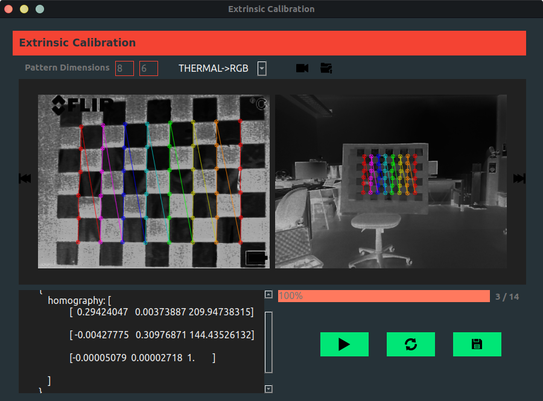

# **Stereo Camera Calibration**

This is a simple desktop application to carry out the process of performing the Stero calibration of any pair of camera as long as you have the appropriate calibration pattern for each camera. In this case, there is the homography matrix that relates the perspective of 2 pairs of cameras: rgb camera to depth camera and thermal camera to rgb camera. The matrix is saved in a .json format file

## Stero Calibration Results

### Stero calibration rgb camera and depth camera
Homography matrix result:
```
{
    "homographyMatrix": [
        [1.0819969500137874, 0.017251494265154415, -20.626941586246897],
        [-0.012360766358243186, 1.1152452865213556, -33.18791897305533],
        [-6.724964767791937e-05, 6.627478506708851e-05, 1.0]
    ]
}
```
### Stero calibration thermal camera and rgb camera
* after calibration.
Here it is necessary to do a pre-processing so that the pattern is detected by the two cameras.


Homography matrix result:
```
{
    "homographyMatrix": [
        [0.29424046705638934, 0.0037388668083184816, 209.94738315208423],
        [-0.004277747148311227, 0.30976870602627143, 144.43526131626922],
        [-5.078621245575828e-05, 2.7181668475245755e-05, 1.0]
    ]
}
```

## Dependencies

* Ubuntu +18.04
* **[libfreenect](https://github.com/OpenKinect/libfreenect)**
* Python3.7
* Opencv-python
* Numpy
* Pyside2

**[libfreenect](https://github.com/OpenKinect/libfreenect)** is necessary for enter the microsoft kinect camera. If you are using a different camera you need to modify the file *DataAcquisition.py* and ready, you can use the application.

## Project Setup
```
    pip install -r requirements.txt
```
## Run Project
```
    python3.7 src/ExtrinsicCalibrationWidget.py
```

